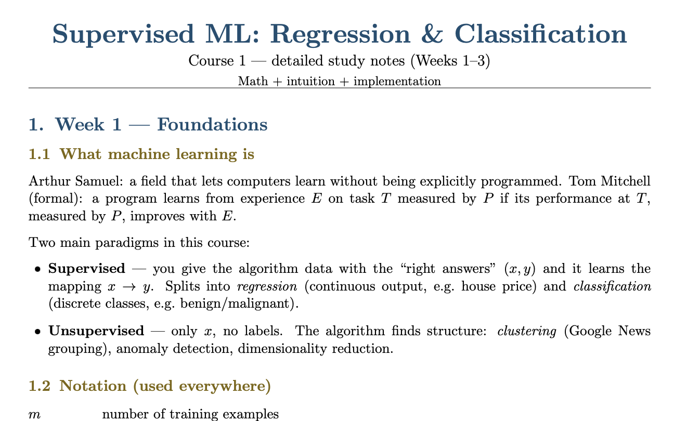

# Coursera Machine Learning Specialization — Revision Notes (Andrew Ng)

Concise, detailed study notes for all 3 courses of the Machine Learning Specialization by Andrew Ng on Coursera.

**Course:** Machine Learning Specialization  
**Offered by:** Coursera — DeepLearning.AI & Stanford University  
**Instructor:** Prof. Andrew Ng  
**Course Link:** [Coursera Course Page](https://www.coursera.org/specializations/machine-learning-introduction)

---

---

## Notes

| Course | Topic | View |
|--------|-------|------|
| Course 1 | Supervised ML: Regression & Classification | [View Notes](https://docs.google.com/viewer?url=https://raw.githubusercontent.com/caitlin-leonard/coursera-andrew-ng-machine-learning-notes/main/ML_Course1_Detailed_Notes.pdf) |
| Course 2 | Advanced Learning Algorithms | [View Notes](https://docs.google.com/viewer?url=https://raw.githubusercontent.com/caitlin-leonard/coursera-andrew-ng-machine-learning-notes/main/ML_Course2_Detailed_Notes.pdf) |
| Course 3 | Unsupervised Learning, Recommenders, RL | [View Notes](https://docs.google.com/viewer?url=https://raw.githubusercontent.com/caitlin-leonard/coursera-andrew-ng-machine-learning-notes/main/ML_Course3_Detailed_Notes.pdf) |

---

## License
These notes are released under [The Unlicense](https://unlicense.org/).
Free to use, share, and adapt — no attribution required.
